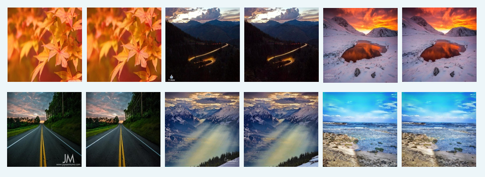
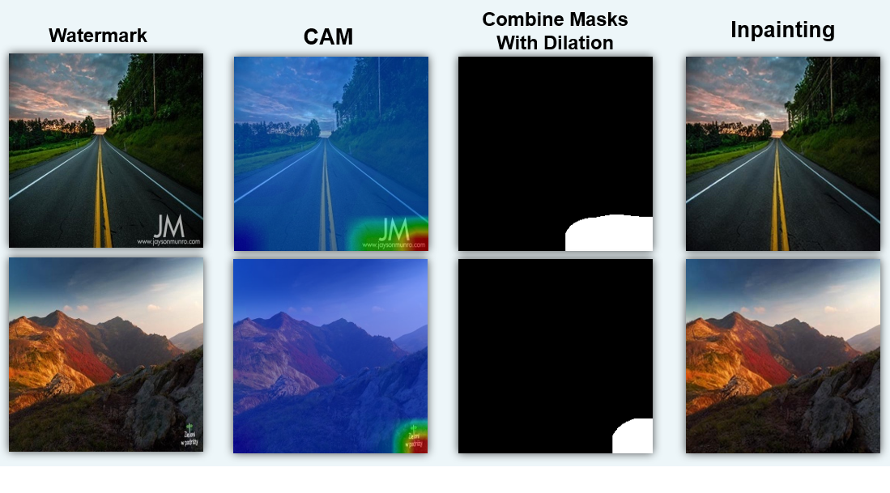
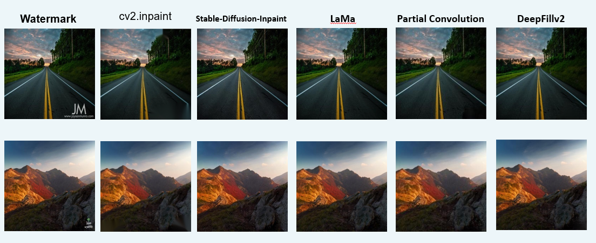
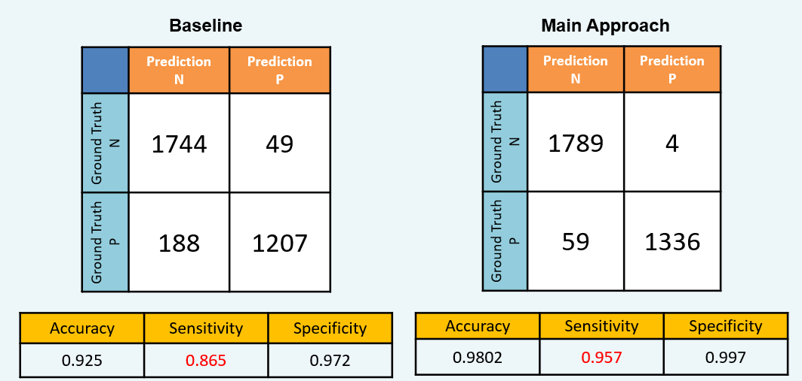
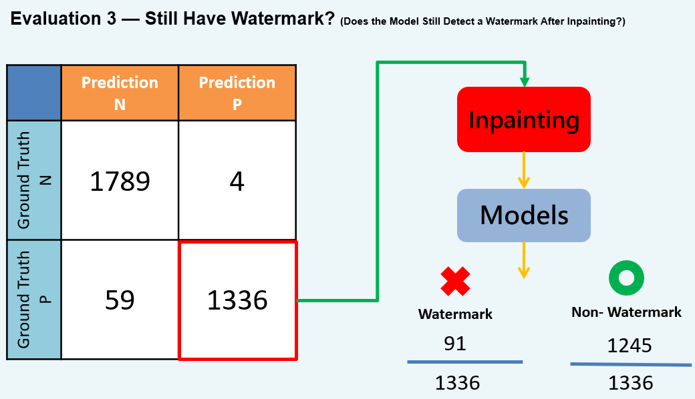

# Watermark Removal: A Weakly Supervised Approach Using Multi-View Visual Models and Inpainting




## Requirements
```
pip install -r requirements.txt
```
## Datasets From kaggle
- [Kaggle watermark dataset](https://doi.org/10.34740/KAGGLE/DSV/5811178) <-- Download the train part, and split it into train, val , test by random
- [With our split](https://doi.org/10.34740/KAGGLE/DSV/5811178) <-- Same split in our experiment

## Step0. Image Preprocessing to Multi-View
- According to your root , modify it in code.
```
input_root = "./data"  <--- According to your root , modify it in code.
output_root = "./dataset_****"

cd step0_Img_preprocessing
python clahe.py
python gray.py
python meg.py
python sobel.py

#There will have 5 datasets after this step.
```
## Step1. Training model
- According to your file name, modify it in code.
```
# data_dir = './dataset/' <--- According to your file name , modify it in code.

#run code
python step1_train.py

#You have to train 5 models for 5 dataset.
```
## Step2. Voting to enhance recall
- According to your file name/root, modify it in code. 
```
# ==========================
DATA_DIRS = [
    "./dataset_ori/test/",
    "./dataset_gray/test/",
    "./dataset_CLAHE/test/",
    "./dataset_meg/test/",
    "./dataset_sobel/test/",
]
MODEL_PATHS = [
    "./resnet50_ep.pkl",
    "./resnet50_ep_100_gray.pkl",
    "./resnet50_ep_100_clahe.pkl",
    "./resnet50_ep_100_meg.pkl",
    "./resnet50_ep_100_sobel.pkl",
]
# ==========================

#run code
python step2_voting.py

#You will get the Voting performence on test.
```
## Step3. CAM to Mask
- According to your file name/root, modify it in code. 
```
DATA_DIR = "./dataset_ori/test/P/"       # 單一資料夾
MODEL_PATHS = [
    "./resnet50_ep.pkl",             # ORI 模型
    "./resnet50_ep_100_gray.pkl",    # GRAY 模型
    "./resnet50_ep_100_clahe.pkl",   # CLAHE 模型
    "./resnet50_ep_100_meg.pkl",     # MEG 模型
    "./resnet50_ep_100_sobel.pkl",   # SOBEL 模型
]

#run code
python step3_Cam_to_mask.py

#You will get the mask_outputs fold and cam_outputs folds.
```

## Step4.Inpainting on Colab
- [Main Inpaint code (Stable-Diffusion-Inpaint)](https://colab.research.google.com/drive/1TiPyjSF8TU-NQiozjsXROZE5zkQGJrcr?usp=sharing)
- According to your file name, modify it in code. You need have origin fold and mask fold.
- We provide the mask_outputs and test_P that you can skip the step0~step3
- [P_test fold](https://drive.google.com/drive/folders/1SXwS4aK0-wRt4pIpd4-plG8CfSZQWhM8?usp=sharing)
- [mask_output](https://drive.google.com/drive/folders/1W8qJEmMQMIJm6Z1Gz4CGc7cN_75PnXgM?usp=sharing)
```
#According to your file name, modify it in code. You need have origin fold and mask fold
# ==========================
INPUT_DIR = "/content/drive/MyDrive/test_P/"     # 原圖資料夾
MASK_DIR  = "/content/drive/MyDrive/mask_outputs"      # mask 資料夾
# ==========================

#You will get the output_inpaint fold.
```



SINGLE IMAGE INPAINTING TEST ,  You can try other inpainting model for single image. We have organized them.
- [LaMa](https://colab.research.google.com/drive/1HnJHSdmJX0aFYq4bdilXC59RHQtWKEQn?usp=sharing) Good results
- [Partial Convolution](https://colab.research.google.com/drive/1Cyfyd7zVlK1mcRAR7aMT0sv42Td3TSy3?usp=sharin) Good results
- [DeepFillv2](https://colab.research.google.com/drive/1TiPyjSF8TU-NQiozjsXROZE5zkQGJrcr?usp=sharing) Good results
- [GLCIC](https://colab.research.google.com/drive/1TiPyjSF8TU-NQiozjsXROZE5zkQGJrcr?usp=sharing) Not ideal

## step5_Eval3_if_still_watermark
- According to your file name/root, modify it in code.
- results fold is the output_inpaint we get on step4
```
#According to your file name, modify it in code. You need have origin fold and mask fold
# ==========================
DATA_DIR = "./results/"  # 單一資料夾，裡面只有影像
MODEL_PATHS = [
    "./resnet50_ep.pkl",             # ORI 模型
    "./resnet50_ep_100_gray.pkl",    # GRAY 模型
    "./resnet50_ep_100_clahe.pkl",   # CLAHE 模型
    "./resnet50_ep_100_meg.pkl",     # MEG 模型
    "./resnet50_ep_100_sobel.pkl",   # SOBEL 模型
]
# ==========================


#run code
python step5_Eval3_if_still_watermark.py

#You will get a csv that let you know which images still have watermark
```

## Results




